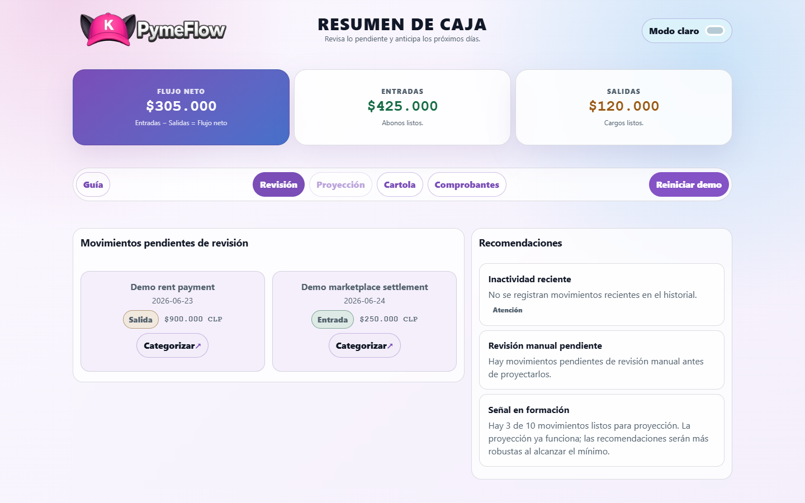
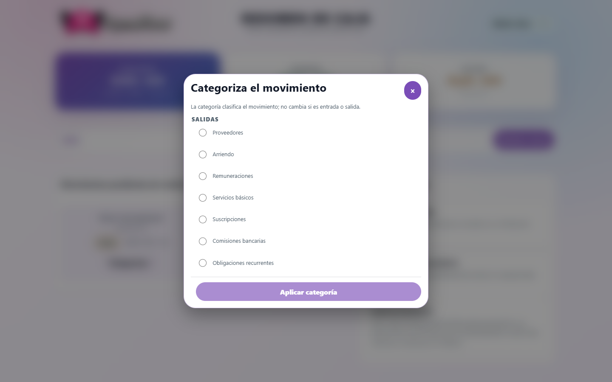
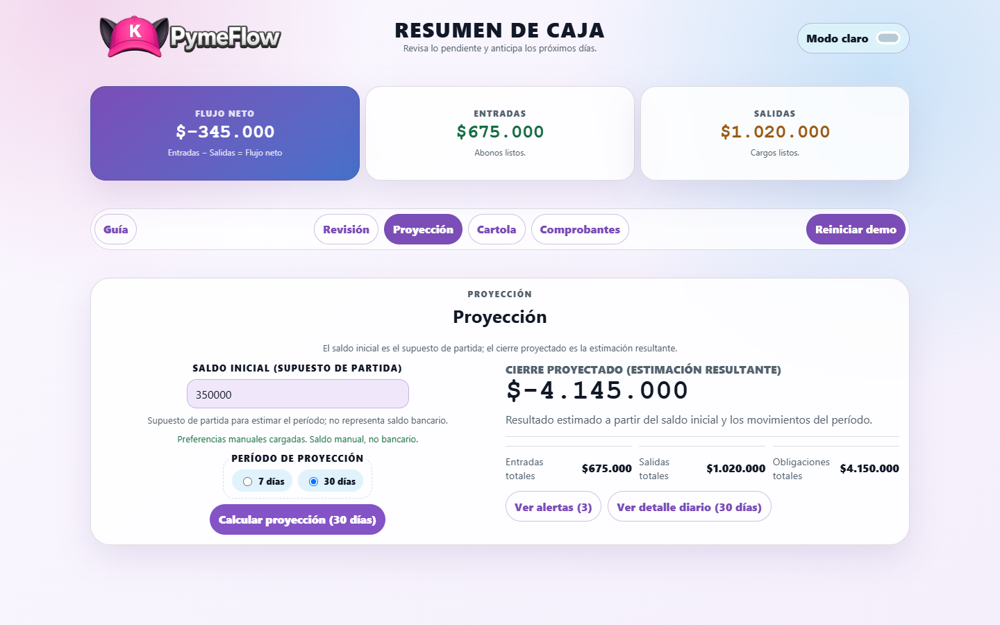
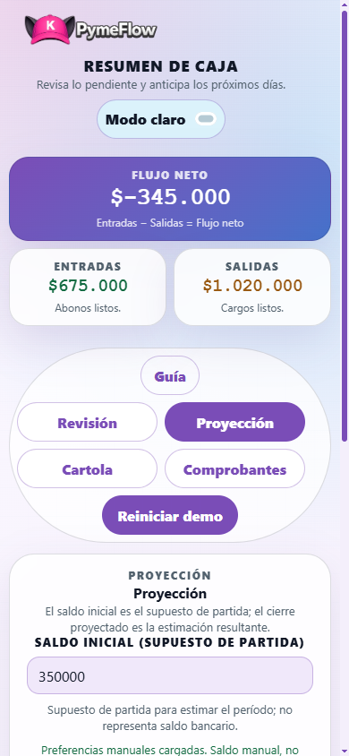

# PymeFlow MVP

PymeFlow brings a small business's daily cash information into one place. The cockpit shows money coming in, money going out, movements that still need review, and an estimate of how cash could evolve over the next week or month.

This MVP demonstrates that workflow with a pharmacy-oriented Chilean demo profile, simulated provider data, and PostgreSQL persistence. It is designed for local evaluation and demos, not production financial operations.



*The main cockpit keeps the operating sequence visible: review movements first, then project cash from categorized history.*

## The Journey

1. **Start with the demo.** Use **Reiniciar demo** to restore a known set of example movements.
2. **Review what needs attention.** **Revisión** separates pending movements from those already included in the cash summary.
3. **Categorize each pending movement.** PymeFlow only offers categories that match whether the movement is an **Entrada** or **Salida**. Once every pending movement is categorized, **Proyección** becomes available.
4. **Estimate the next seven or 30 days.** Enter a starting balance, choose the period, and select **Calcular proyección** to see the estimated closing balance, totals, obligations, and alerts.
5. **Inspect the supporting information.** **Cartola** shows the movement history, while **Comprobantes** exposes the evidence produced by the simulated demo operations.



*A movement marked as **Salida** only offers categories that belong to **Salidas**.*



*The projection is a decision-support view: its opening balance is manual and does not represent a live bank balance.*



*The projection controls remain readable and usable on a narrow screen when a cash check has to happen away from a desk.*

## What You Can Evaluate

- Whether **Flujo neto**, **Entradas**, and **Salidas** make the current cash position easy to understand.
- Whether pending movements can be reviewed and categorized clearly as **Entradas** or **Salidas**.
- Whether seven- and 30-day projections, alerts, obligations, **Cartola**, and **Comprobantes** support a practical daily cash conversation.
- Whether the desktop and responsive mobile cockpit are clear enough for a small-business operator.

## Quick Start

Install Docker Desktop, then run:

```bash
git clone https://github.com/DevMPoveaCL/kurone-ko-pymeflow.git
cd kurone-ko-pymeflow
docker compose up --build
```

Open [PymeFlow](http://localhost:8080). The application waits for PostgreSQL to become healthy; its Docker health endpoint is [http://localhost:8080/actuator/health](http://localhost:8080/actuator/health).

## Roadmap

The [PymeFlow roadmap](ROADMAP.md) describes the ordered path from the current cashflow MVP to trustworthy, explainable financial decision support. The next focus is deterministic scenario foundations for comparing a cash baseline with a loan or other financing scenario; no chat or LLM integration is planned in that first slice.

## Reference

### Demo Reset

Use **Reiniciar demo** in the cockpit to restore the guided `pharmacy-cl` dataset. For API-level evaluation, the same action is available in Swagger UI as `POST /api/cockpit/demo/reset-and-seed?profileId=pharmacy-cl`. Resetting deletes and replaces that profile's demo data.

### Local Java Development

Use JDK 21. The repository includes the Gradle 8.10.2 wrapper, so a separate Gradle installation is not required. Start PostgreSQL, then run the application from the repository root:

```bash
docker compose up -d postgres

# Windows PowerShell
.\gradlew.bat bootRun

# macOS/Linux
./gradlew bootRun
```

The local datasource defaults to `jdbc:postgresql://localhost:5432/pymeflow`. Copy `.env.example` to `.env` only when changing development defaults, and export those values before `bootRun`.

### URLs And Ports

| Resource | URL or port |
| --- | --- |
| Application | [http://localhost:8080](http://localhost:8080) |
| Swagger UI | [http://localhost:8080/swagger-ui.html](http://localhost:8080/swagger-ui.html) |
| OpenAPI document | [http://localhost:8080/v3/api-docs](http://localhost:8080/v3/api-docs) |
| Health | [http://localhost:8080/actuator/health](http://localhost:8080/actuator/health) |
| Application port | `8080` |
| PostgreSQL port | `5432` |

### Environment Variables

| Variable | Default | Purpose |
| --- | --- | --- |
| `PYMEFLOW_DATASOURCE_URL` | `jdbc:postgresql://localhost:5432/pymeflow` | JDBC URL for local Java execution; Compose uses the `postgres` container hostname. |
| `PYMEFLOW_DATASOURCE_USERNAME` | `pymeflow` | PostgreSQL username. |
| `PYMEFLOW_DATASOURCE_PASSWORD` | `pymeflow_local` | PostgreSQL password for local development only. |
| `PYMEFLOW_ACTIVE_PROFILE` | `pharmacy-cl` | Active vertical profile. |
| `PYMEFLOW_MOCK_BANK_SETTLEMENTS` | `false` | Enables simulated bank settlements. |
| `PYMEFLOW_MOCK_ACQUIRER_SETTLEMENTS` | `false` | Enables simulated acquirer settlements. |
| `POSTGRES_DB` | `pymeflow` | Database created by the Compose PostgreSQL service. |
| `POSTGRES_USER` | `pymeflow` | PostgreSQL service user. |
| `POSTGRES_PASSWORD` | `pymeflow_local` | PostgreSQL service password for local development only. |

`.env.example` contains non-secret development values. Use real secret management and TLS-enabled PostgreSQL before a production deployment.

### Tests

The complete suite needs the PostgreSQL service because Flyway and persistence integration tests connect to the local development database. The latest verification passed **365 tests**.

```bash
docker compose up -d postgres

# Windows PowerShell
.\gradlew.bat test
.\gradlew.bat jacocoTestReport

# macOS/Linux
./gradlew test
./gradlew jacocoTestReport
```

JaCoCo writes HTML coverage to `build/reports/jacoco/test/html/index.html` and XML coverage to `build/reports/jacoco/test/jacocoTestReport.xml`.

### Architecture

PymeFlow is a Java 21 service built with Spring Boot 3.3.6 and PostgreSQL 16. Its hexagonal structure keeps domain rules separate from application use cases and their web, persistence, provider, and demo adapters.

```text
src/main/java/com/kuroneko/pymeflow/
  domain/          Business concepts and rules
  application/     Use cases and port contracts
  infrastructure/  PostgreSQL, configuration, provider, and demo adapters
  interfaces/web/  REST controllers and HTTP error handling
src/main/resources/
  db/migration/    Flyway schema migrations and development seed data
  static/          Cockpit assets served by Spring Boot
src/test/          Unit, architecture, web, persistence, and integration tests
```

### Troubleshooting

| Symptom | Resolution |
| --- | --- |
| Port `5432` or `8080` is in use | Stop the conflicting service or change the host mapping in `docker-compose.yml`. |
| Application cannot connect to PostgreSQL | Run `docker compose ps`, wait for `postgres` to become healthy, and verify datasource variables. |
| Flyway migration error after changing local schemas | For disposable local data only, run `docker compose down -v` and start again. |
| `JAVA_HOME` error | Install JDK 21 and set `JAVA_HOME` to that JDK. |

### Limitations

- The MVP uses simulated provider integrations and a pharmacy-focused demo profile.
- It does not provide production authentication, authorization, tenant isolation, audit trails, backups, or operational monitoring.
- Development PostgreSQL credentials are intentionally public and must not be reused outside local development.
- Forecasts are decision-support demonstrations, not accounting, tax, or financial advice.

### Author and rights

**Author:** DevMPoveaCL

See [LICENSE](LICENSE).

© DevMPoveaCL. All rights reserved. This project is shared as a portfolio/MVP preview and is not licensed for reuse, redistribution, or commercial use without permission.
